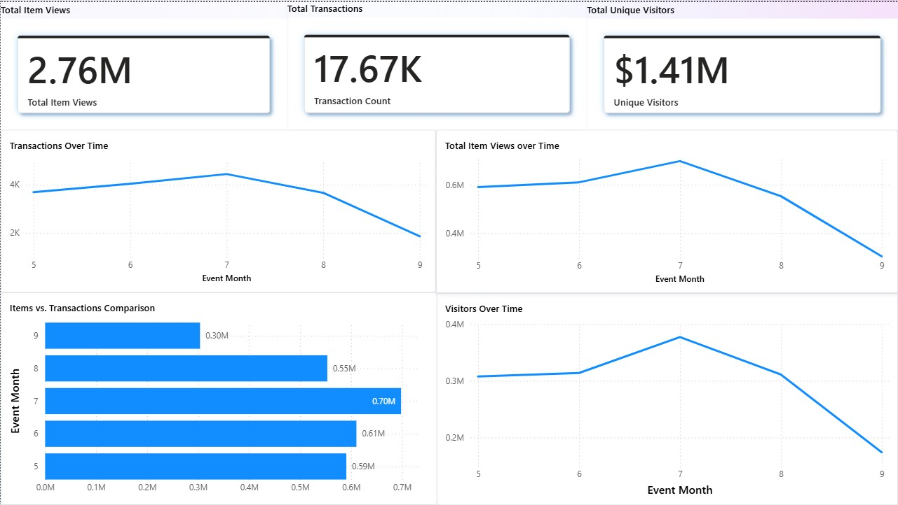
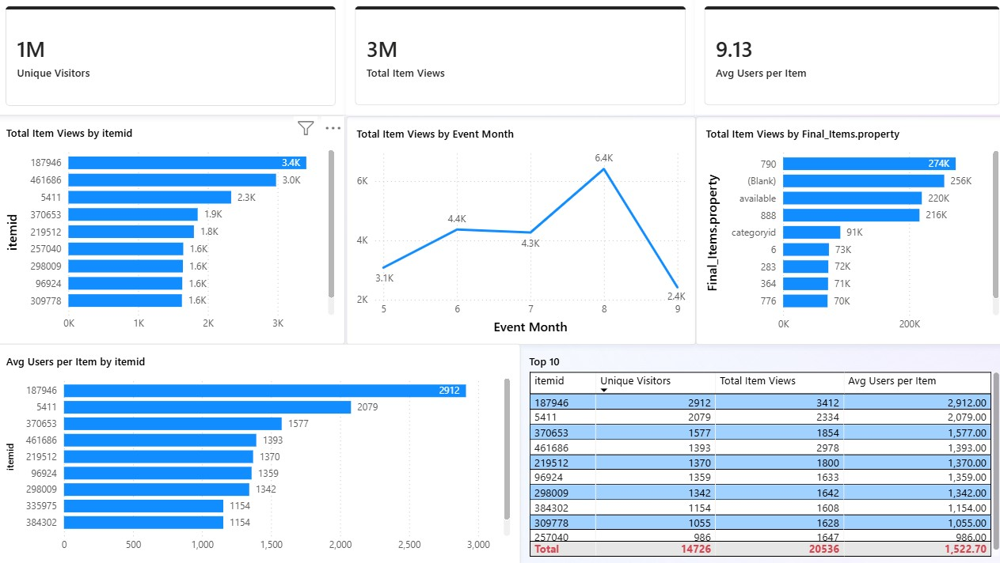
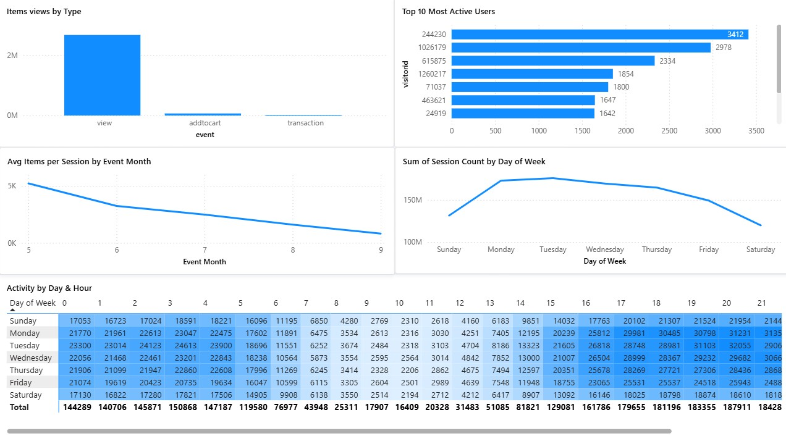

# Power BI Operational Data Analysis

## Overview
This Power BI project analyzes operational and event-based data to uncover usage patterns, category trends, and actionable insights.  
The dashboard is designed to help decision-makers understand key metrics, evaluate performance, and identify areas for process and product optimization.

This project focuses on **operational and behavioral analysis**, rather than traditional sales reporting.

---

## Dataset
- Source: Public dataset from Kaggle (retail operational and transaction data)
- Scope: Transactions, product interactions, and user engagement events
- Volume: Approximately 215,000 records
- Purpose: Supports analysis of usage patterns, product performance, and engagement insights

---

## Tools & Skills
- Power BI Desktop  
- DAX (Measures & Calculated Columns)  
- Data Modeling & Relationships  
- Data Cleaning & Transformation  
- Business & Operational Analysis  
- Data Visualization  

---

## Dashboard Preview

### Key Metrics Overview

**What this shows:**
- High-level operational KPIs  
- Overall usage and performance trends  
- Executive-style snapshot for quick insight  

---

### Product Performance Analysis

**What this shows:**
- Performance metrics across products and categories  
- Identification of high-performing and underperforming segments  
- Comparative analysis to support optimization decisions  

---

### User Engagement Insights 

**What this shows:**
- User interaction and engagement patterns over time  
- Behavioral trends and activity distribution  
- Insights into how users interact with products and features  

---

## Key Takeaways
- Built an end-to-end Power BI dashboard from raw data  
- Translated complex operational data into clear business insights  
- Designed visuals with stakeholder and decision-maker use cases in mind  
- Applied analytical thinking to evaluate performance and engagement trends

---

## Future Enhancements
- Add advanced DAX measures for deeper trend analysis  
- Incorporate additional datasets for richer context  
- Expand insights to support predictive or strategic decision-making
- Refine visual storytelling for executive and stakeholder presentations

---  
  
  ## Project Report
  For full analysis and methodology, see the project report:  
  Download PDF: https://docs.google.com/document/d/153geR49LrE8rnAYEEb-xW_I_TL0yOmBKzVa9k77ksDw/edit?usp=sharing
  
  ## Download Dashboard
  If you want to explore the dashboard interactively, download the Power BI file here:  
  Download PBIX: https://1drv.ms/u/c/0bc94a9f0c189551/IQDBglI0mzNnRIskM1vkcvB4Acd3-EsSi8xLTjToq3hXdZA?e=A4jbWD
  
 --- 
 
  **Author:** Anay Pramodh  
  **Focus Areas:** Business Analytics | Product Insights | Data Visualization
